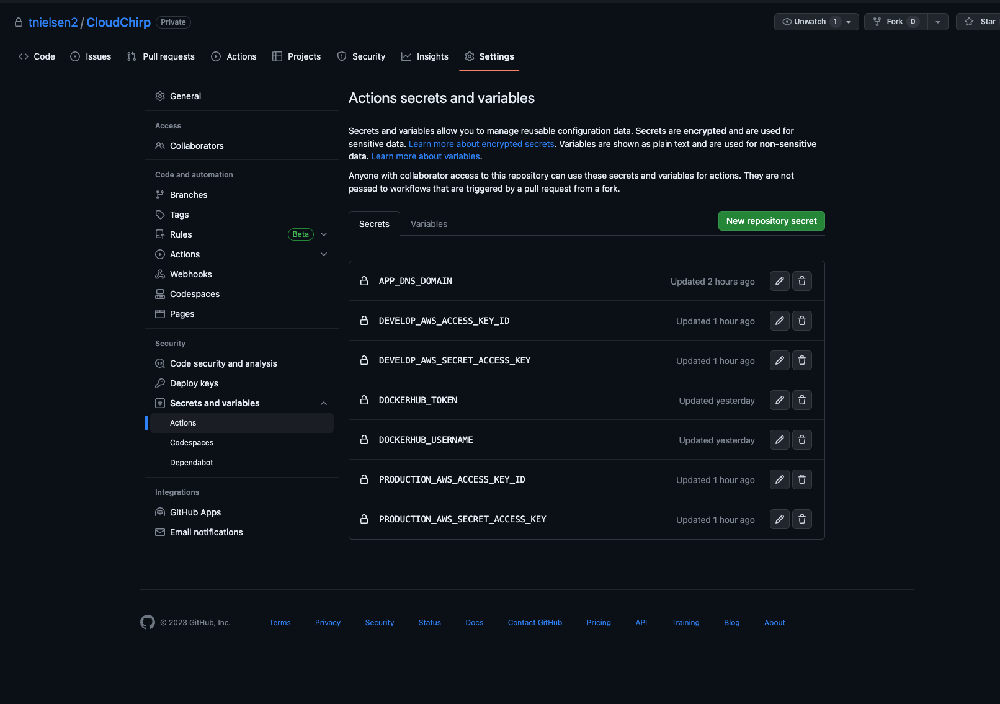

# CloudChirp

Text-to-Speech Solution on AWS with Polly, CloudFront, and S3

### Pre-requisites
- AWS profile used to deploy CloudFormation stacks. 
- Dockerhub account and personal access token configured. 
- Registered domain (preferably hosted in Route53 for easy ACM validation)

### App deployment
1. Clone this repo.
2. Checkout your branch name. The branch name is used to create a unique stack and environment for deployment. The app is configured for `develop` and `main` branch names.
3. Install your requirements
```shell
pip3 install -r ./app/requirements.txt
```
4. Create .env file in the root of the repo and populate the following variables (note the trailing dot on the dns domain):
```
APP_DNS_DOMAIN=example.domain.
AWS_ACCESS_KEY_ID=appCredentialsPopulatMeAfterCfnDeployment
AWS_ACCOUNT_NAME=account-name
AWS_ACCOUNT_NUMBER=123456789123
AWS_DEFAULT_PROFILE=account-profile-configured in ~./aws
AWS_SECRET_ACCESS_KEY=appCredentialsPopulatMeAfterCfnDeployment
```
5. Generate your Cloudformation template
```shell
python3 cloudformation/template.py
```
6. Deploy your CloudFormation stack using the profile configured in .env using the shell script below.  
```shell
branch_name=$(git rev-parse --abbrev-ref HEAD)

if [[ "$branch_name" == "main" ]]; then
  ENVIRONMENT="production"
else
  ENVIRONMENT="$branch_name"
fi

echo "Running in $ENVIRONMENT environment"
source .env && aws cloudformation deploy --template-file cloudformation/$ENVIRONMENT-template.json --stack-name $ENVIRONMENT-cloudchirp --region us-east-1 --capabilities CAPABILITY_NAMED_IAM CAPABILITY_AUTO_EXPAND
```
7. Ensure your ACM validation completes. AWS certificate manager will require you to validate your domain. If hosted in Route53 this is a 1 click deployment.

8. Fetch your aws access keys from the stack outputs and store Github actions secrets as `AWS_ACCESS_KEY_ID` and `AWS_SECRET_ACCESS_KEY`. Also add these to your .env file you want to test locally.
9. You will now need to configure your Dockerhub credentials `DOCKERHUB_USERNAME` and `DOCKERHUB_TOKEN` for CI to push to Dockerhub.
10. Configure your secrets in the GitHub actions menu. Take note that each environment key has a unique prefix. 

11. Re-run Actions to build and populate the files.